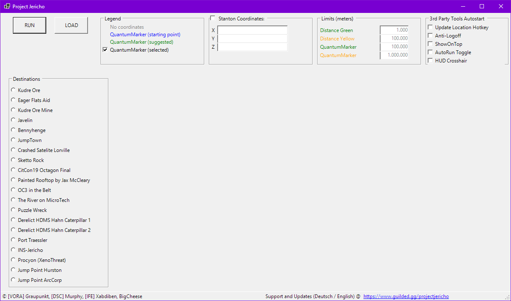
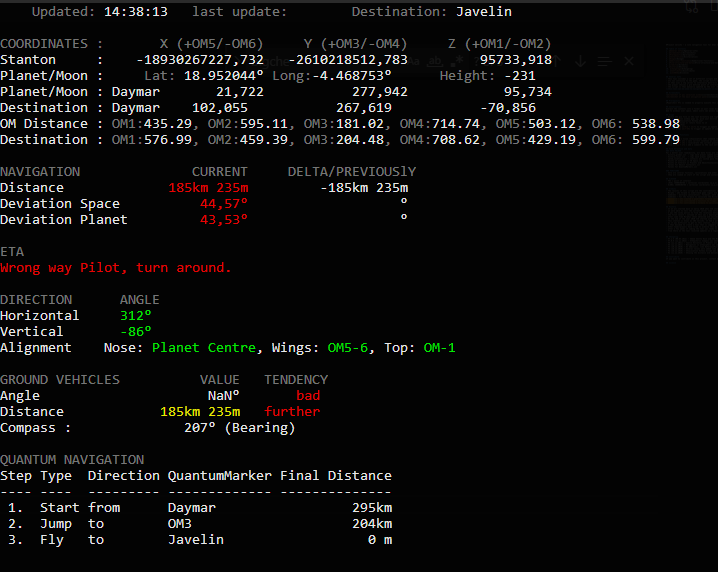

#Project Jericho - a live navigation tool for Star Citizen

## Table of Contents
1. [General Info](#general-info)
2. [Screenshots](#screenshots)
3. [Prerequests](#prerequest)
4. [Installation](#installation)
5. [Usage](#usage)
6. [Additional-functions](#additional-functions)
7. [File-structure-and-data](#file-structuce-and-data)
8. [credits](#credits)
9. [history](#history)
10. [changelog](#changelog)
11. [Contribute](#contribute)
12. [LICENSE](#license)

## General Info
- This tool includes a set of different scripts and other tools to acheive its goal for live navigation in Star citizen. 
- Its non intrusive to the game, the script monitors the windows clipboard for the actual player position, that gets triggered by the StarCitizen Chatcommand /showlocation. 
- It than uses a ntp server to internally determine the current utc time and the offset of the system time to increase the precision of calculations
- the player chosses a pre defined point of interest and starts live navigation
- the script is than manually updated by the user (key combo) and gets multiple values presented for navigation
- this tool can be used to navigate to points in space and around planets

Windows 11 does not allow powershell scripts that are created by others by default, you need to run the following line to change this behavior:
Set-ExecutionPolicy Unrestricted -Scope LocalMachine -Force
than open powershell and drop the scriptfile into the window and unblock the script with adding this after the file
| Unblock-File

## Screenshots

## Prerequests
Powershell V7 is needed to properly execute this script. You can grab it from here https://aka.ms/powershell-release?tag=stable . You can install it by using the default options I recommend to add "run with powershell 7" contect menu during install. Current Versions verified are 7.1.x until 7.2.3.

## Installation
- Extract the contents into a folder on your local disk and run the scripts from there.

Notes:
A network drive might not work if windows has not been modified to allow administrator users to access network shares. Since by default Windows permits admin users to access network shares and this script requires admin permissions in case StarCitizen or the RSI Launcher is running with admin permissions too. This is due to windows user space, admin users can access applications run with admin right and users can only access applications with user rights. You might notice this if you voice comm overlay is not working in certain games, its because of the different user space both applications use.

## Usage
- Select the "Project Jericho.ps1" file in the root directory and right click on it and click on "run with powershell 7"
- Now a selection window pops up, pick your desired destination from that list.
- Start the "ShowLocation Hotkey.exe" 
- Start StarCitizen or return focus to its window
- if not visible, enable chat with  [F12]
- trigger an update of your current position by pressing the following key combo:
    - (EN/US) press [CTRL] + [ALT]
    - (EU/DE) press [ALT-GR]
- follow the instructions in the "Quantum Navigation" tab
- after you arrived at the desired Orbital marker, you have two options 
- A) Align your ship after in the "Direction" tab dscribed orientation and use a turret to determine the location of the poi
- B) skip step A and fly down into athmosphere, so you get the comapss reading
- enter athmosphere and follow the "Ground Vehicles" Tab, to follow your route

## Additional Functions
### Hotkeys
- [ALT] + [GR] = Issue /showlocation chat command to star citizen window (chat needs to be enabled [F12] and you need to start this dedicated tool before useage)
- hold [CTRL] + [S] = save current location as custom poi, focus script window than hold key kombination, a beep sound occurs and you can enter a poi name, press [ENTER] to save
- hold [CTRL] + [R] = recalibrate the current planet/moon to less than 15m accuracy. Get to OM-3 as close as possible, update your position, focus the script windows and hold key kombination
- hold [CTRL] + [T] = add a comment to the last entry in the logfile, which logs each showlocation update. Focus script window than hold key kombination, a beep sound occurs and you can enter ur comment, press [ENTER] to save

## File Structuce and data
### DATA FOLDER
For a better user readibility, all data files are stored in the csv so they can easily be viewed and filtered/sorted with excel. Also powershell makes it much easier to read from CSV than from JSON
- history_global.csv  - logs each player update with global cooridnates 
- history_local.csv   - logs each player update with local  coordinates
- saved_locations.csv - contains all custom pois that were saved with the CTRl + S command
- Points of Interest in 3D Space.csv                     - Predefined Locations in 3D Space, like INS Jericho or the two locations of jump points that occured in a ptu build
- Points of Interest on Planets and ObjectContainers.csv - Contains all Points of Interest 
- Values for Object Containers.csv                       - 
- Values for QuantumMarkers.csv                          - 

### FUNCTIONS
- here are several fuctions, calculations and other code outsourced from the script
- they are loaded on start of the script and contain basic stuff

## GLOSSAR
- POI = point of interest
- LOCAL COORDINATES = cartesian coordinates (x,y,z) in an moving or rotating object container, like crusader, daymar, MIC-L1
- GLOBAL COORDINATES = cartesian coordinates (x,y,z) in the current system

## Credits
- The results of this script are the contributions of many. 
- Murphy - who helped to understand game logics and multiple calculations and formulas
- Xabdiben - multiple calculations, formulas, math and logics 
- Xabdiben - for the formula to calculate the Distance between two points in 3d space
- Xabdiben - for the formula to calcualte a course deviation in athmosphere
- BigCheese - who created a powershell formula called "Ebenenwinkel", whichs allows to calcule a deviation in athmosphere, but only on a horizontal plane (useful for racing/athomsphere flight if the poi is below are above the horizon)
- BigCheese - who contributed a function to trigger keyboard shortcuts
- BigCheese - for contributed a formula to calculate the ingame compass reading (bearing)

## History
- It at all started back in early 2020 when CIG started to introduce server simulations to the game
- we were able to tell the current server time (utc) and the server simulation time with the r_displayinfo 1 console command
- I was the lucky person to find the relations between both times, that allowed Murphy and me to make calculations and predictions
- The first result / outcome of this was a day/night prediction sheet. While i did it in excel, it turned out that murphys google sheet version was much more usable and sharable with the community
- after some time Murphys sheet advanced and included many complicated calculations, which were all created by Murphy himself
- At the end of the year 2020 CIG started with their first great server event xenothreat. In preparation for that a naval station was added to the game. 
- This station is known as INS Jericho. It had a persistent Quantum Beacon in the early days of evocati, but that beacon vanished in future ptu builds.
- So it was difficult to get to this station, because we had to travel around 2000km in free space. 
- I than decided to create a tool that is cappable of live navigating the user to INS Jericho, so I called it Project Jericho.
- Other teams/players have tried to acheive this by different ways, like using quantum travel and pictures to guide the player, but i wanted something better, something more precise that allowed you to align your ship once and keep it going for minutes
- after a few weeks of coding the tool was ready to be used and helped their first users to get to Jericho
- from there on the tool received updates on a regular basis and functions were added. With the knowledge of the day/night prediction sheet it was possible to create 

## Changelog
- V7.1.4 (09.04.2022) - Added Sketto Rock and the MicroTech River to the list of predetermined POIs, Multiple Logs where added, Several Bug Fixes
- V7.0.9 (xx.xx.2022) - Athmpsheric Compass was added, several Bug Fixes
- V6 (xx.xx.202x) - Course Deviation in Planets and Ground were added
- V5 (xx.xx.202x) - Navigation in athmosphere was added, many custom pois on planets have been added, a poi selection ui was introduced
- V4 (19.12.2020) - UI Additions, like ReferencePoints, CustomCooridnates, Deviation from the current destination was added, addded ETA (estimated time until arrival), added colored values (changed to powershell v7)
- V3 (16.12.2020) - Several values were added like global coordinates, destination coordinates and more
- V2 (16.12.2020) - ShowLocation Hotkey Script was added
- V1 (xx.11.2020) - Showing the distance and deviation from the players course to the destination of INS Jericho

## Contribute
If you want to contribute on this project, contact me on discord or join our community of passionate explorers, developers and more at Meridian. https://discord.gg/WMh5YCeQVS

## License
